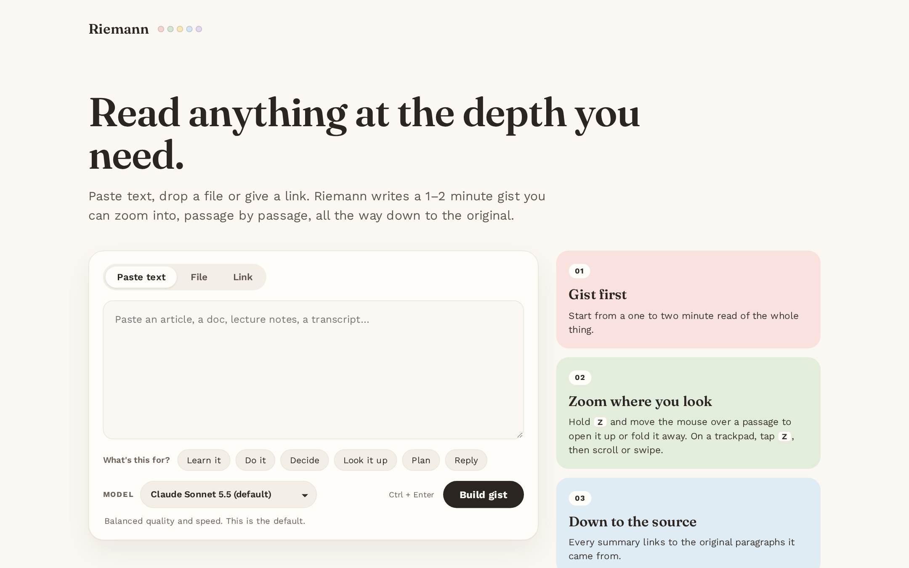
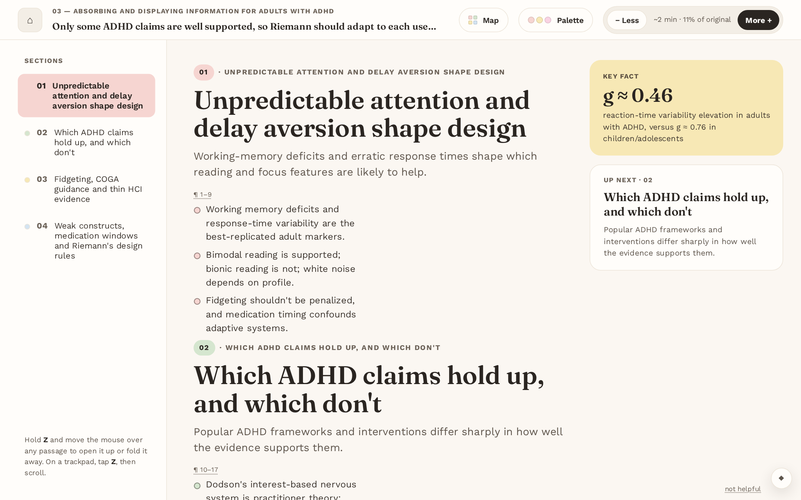
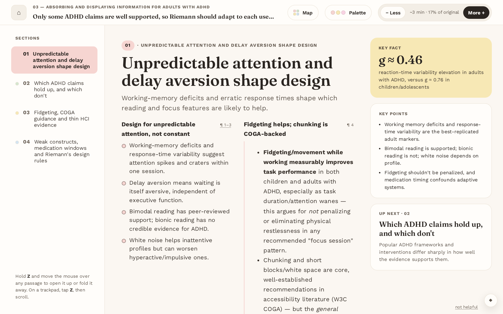
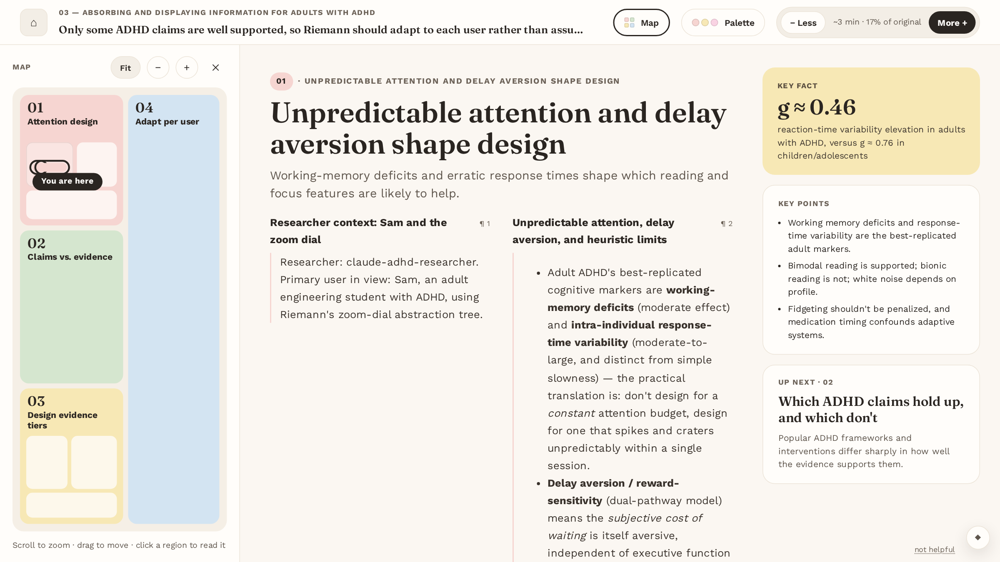
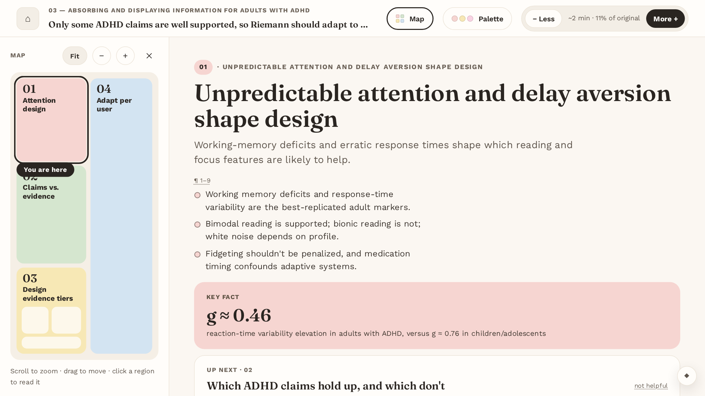

# Riemann

**Read anything at the depth you need.**

Riemann is a reading assistant built for an ADHD brain. Give it an article, a paper, lecture notes or an assignment brief, and it builds an *abstraction tree*: a one-to-two-minute gist at the top, section titles and bullets below that, then summaries, and finally the original paragraphs. A continuous zoom dial moves you up and down that tree, passage by passage, and the page stays pinned to wherever you were looking.



## Why

Long documents are hard to start and easy to lose your place in. Riemann starts from the smallest useful version of the text and lets you open up only the parts you care about, so there's always a quick way in and you never have to hold the whole thing in your head.

The design is grounded in the research notes in [`research/`](research/). In particular [`RIEMANN-ABSORPTION-MODEL.md`](research/RIEMANN-ABSORPTION-MODEL.md) covers what the evidence does and doesn't support for adult ADHD reading.

## What it does

### Gist first, then zoom where you look

Every document opens as a short gist: section titles with two or three skim bullets each. Everything links back to the source paragraphs it came from (`¶ 1–9`).



Zoom in and the section you're pointing at unfolds into titled sub-points, then prose, then the original text. Zooming over a section only ever changes that section: every step shows a change there, and when it is fully open (or as compact as it gets) the block gives a brief outline pulse and nothing else on the page moves.



**How to zoom**

| Input | Zoom |
|---|---|
| Mouse | Hold **Z** and move the mouse left or right over a passage (zooms that section only) |
| Trackpad | Tap **Z**, then scroll or swipe with two fingers (tap Z again, press Esc or pause to stop) |
| Pinch | Pinch on the trackpad (or Ctrl + scroll wheel) |
| Keyboard | **=** / **−** zoom the section under the pointer (the whole page when the pointer is off the text, over the overview card or the gist). With the zoom control focused (Tab to it), **Home** / **End** jump to the gist or the full text and the arrow keys step the whole page |
| Buttons | **− Less** / **More +** in the header step the whole page |

The header always shows roughly how long the current view takes to read and what share of the original it covers.

### A map of the document

Press **Map** (or **G**) for a region map of the whole document beside the reader. Sections are coloured districts sized by length, and the map mirrors the reader: what's expanded in the reader is split into its parts on the map, and **You are here** follows your scrolling. Click any region to jump there. Scroll to zoom the map, drag to move it, and **Fit** resets it.



On a laptop screen the map switches to a compact mode that shows only numbers and short key titles. Drag the edge between the columns to make any of them wider or narrower. The widths are remembered, and dragging the map wider brings back the detailed version.



### Built around what the text is *for*

Pick a goal before building, or let Riemann suggest one from the title and format:

| Goal | Summaries focus on |
|---|---|
| **Learn it** | Ideas, explanations and how things connect |
| **Do it** | Deliverables, steps, deadlines and marking criteria |
| **Decide** | Options, trade-offs and the recommendation |
| **Look it up** | Facts, numbers and definitions |
| **Plan** | Timeline, dependencies and owners |
| **Reply** | What's being asked of you and what to say |

The same document built for a different goal is kept as a separate version.

### A quick check-in (optional)

A folding panel on the home page asks about energy, mood, sleep, caffeine and meds, with one tap each. It only changes how a document *opens*, never what the summaries say. For example, low energy or short sleep opens at about a one-minute read with the map closed. Each check-in counts for four hours, and a small note always shows what was adjusted, with an undo.

### Other details

- **Experiment:** an optional, collapsed section on the home page for the two-week check in [`docs/experiment.md`](docs/experiment.md): set the condition, phase and a document label, then get a small "did it help?" card after each document. Off by default and invisible in the reader.
- **Rebuild and interrupted builds:** the ⋯ menu in the header rebuilds the open document with the latest improvements (after asking: it uses one full build of your model usage), and says when a document was built by an older version. A build that was cut off when Riemann stopped offers to start again instead of failing to open.
- **Maths:** `$...$` and `$$...$$` LaTeX is drawn with KaTeX (from a CDN; if it does not load you see the LaTeX text). Prices like "$5 and $10" are left alone, and highlights around a formula keep working.
- **Search:** press `/` or Ctrl+F (or click the magnifier) to search the whole document, including parts you have not opened. Enter and Shift+Enter step through matches; each opens just enough to show it and marks it in the text. Esc closes. Only the length of what you type is logged.
- **Reading settings:** in the palette panel, a letter-spacing toggle and a reading width (narrow, normal, wide); both are remembered.
- **Zoom history:** Alt+Left goes back to the previous zoom level and position, Alt+Right forward; after a big jump a "Back" button shows for a few seconds.
- **Overview card:** above section 01, at every zoom level, a card says what the document is: its own title, a one-sentence description and a few key facts chosen for that kind of document and your goal (for a brief: what to hand in, when it is due, how it is weighted, how to submit, what it is assessed on). Values are short and shown in full, and each has a `¶` link to the passage it came from. Anything the source doesn't say reads "not stated". For an assignment or meeting notes (or the do and plan goals) the card also leads with **Start here** (one first step), **Due** ("Due in 5 days · Fri 14 Nov, 5 pm", worked out from today's date, or "Overdue by 2 days") and **Size of the job**, and meeting notes get an **Actions** list (who, what, due). Documents built before this existed get a card the first time you open them.
- **Files and links:** paste text, upload a `.md`, `.txt`, `.pdf` or `.docx` file, or give a link. PDFs are read by layout (paragraph breaks, bullets, two columns and ruled tables, with headers, footers and page numbers removed); numbered headings become sections, and Word headings, lists and tables are kept. Pasted email loses its quoted replies, signature and legal footer. A link without `https://` gets it added.
- **Minimal chrome:** press **M** to hide the header, section list and side rail and read the text alone. Press **M** again (or the small diamond, bottom right) to bring them back.
- **Palette:** swap the pastel section colours. The Palette panel closes when you click away.
- **Key facts and Up next:** the right-hand rail pulls out a key number and previews the next section.
- **Models:** choose the summarising model from the home page. The default is Claude Sonnet 5.5.
- **Local only:** built trees are cached under `~/.cache/riemann/` and the reading-event log is `~/.local/share/riemann/events.jsonl` (both move under `RIEMANN_DATA_DIR` if you set it). Nothing is sent anywhere except the model calls themselves. The server listens on `127.0.0.1` only, and refuses requests that don't come from your own browser (see Security).
- **Accessibility:** it respects reduced motion, all interactive parts are buttons with labels, and it has a full-screen map sheet on phones.

## Setup

Riemann runs on your own computer and uses your own Claude account for the summaries. The easiest route is through a Claude Code login, so any Claude plan that includes Claude Code works, and there's no API key to manage.

**1. Install the tools**

- [uv](https://docs.astral.sh/uv/getting-started/installation/), the Python package manager. It fetches Python 3.12 for you if you don't have it.
- [Claude Code](https://docs.claude.com/en/docs/claude-code/setup). After installing, run `claude` once and log in.
- Git, to download the repo.

**2. Download Riemann and install its dependencies**

```bash
git clone https://github.com/samsamthecodingman/Riemann.git
```

```bash
cd Riemann && uv sync
```

**3. Start it using your Claude Code login**

macOS or Linux:

```bash
RIEMANN_PROVIDER=agent-sdk uv run uvicorn riemann.server:app --host 127.0.0.1 --port 8765
```

Windows (PowerShell):

```powershell
$env:RIEMANN_PROVIDER="agent-sdk"; uv run uvicorn riemann.server:app --host 127.0.0.1 --port 8765
```

**4. Open <http://localhost:8765>**, paste some text and press **Build gist**.

**Good to know**

- The first build of a long document takes a minute or two. After that it's cached and opens instantly.
- Each build uses your own Claude plan's usage. A typical article is a handful of requests.
- An "unrecognized model" warning in the terminal is harmless if builds still work. If builds fail with a model error, update Claude Code, or start Riemann with `RIEMANN_MODEL` set to a model your version supports.
- To stop Riemann, press Ctrl+C in the terminal.
- To update to the latest version, run `git pull` and then `uv sync`.
- To try it without using any Claude usage, open <http://localhost:8765/?fixture=1>, which loads a built-in sample document.

### Model access

Riemann summarises through one of two providers, chosen with `RIEMANN_PROVIDER`:

| `RIEMANN_PROVIDER` | Uses |
|---|---|
| `proxy` (default) | An OpenAI-compatible proxy at `RIEMANN_PROXY_URL` (default `http://127.0.0.1:8317`). The key comes from `RIEMANN_PROXY_KEY`. |
| `agent-sdk` | Your local Claude Code login, through the Claude Agent SDK |

Other settings:

| Variable | Default | Purpose |
|---|---|---|
| `RIEMANN_MODEL` | `claude-sonnet-5-5` | Default summarising model |
| `RIEMANN_DATA_DIR` | cache `~/.cache/riemann`, log `~/.local/share/riemann` | When set, the tree cache (`cache/`) and the event log (`share/`) both go under this folder |
| `RIEMANN_ALLOW_PRIVATE_URLS` | unset | Set to `1` to let the **Link** tab fetch `localhost` or private-network addresses (blocked by default) |
| `RIEMANN_ALLOWED_HOSTS` | unset | Extra `Host` names the server will answer to, comma separated (only `localhost`, `127.0.0.1` and `::1` by default) |

### Limits

- A document may be at most **50,000 words** (about 200 pages); paste a chapter at a time for anything bigger.
- Uploads may be up to 30 MB, pasted text up to 5 MB, a fetched web page up to 15 MB, and a Word file's text up to 40 MB once unpacked.
- Chinese and Japanese text counts each character as about one word and is split at 。！？; Korean counts by its spaces. Maths in `$...$` shows as source text.

### Security

Riemann is a personal app that spends your model quota and reads your disk, so the server is strict about who can talk to it. It binds to `127.0.0.1`. Requests with a `Host` header that isn't local, or a state-changing request from another website's `Origin`, get a 403, so a page open in another tab can't drive it. JSON endpoints require `Content-Type: application/json`. The **Link** tab refuses non-web schemes and any address that resolves to a loopback, private or link-local machine (including after redirects), so a pasted link can't make Riemann fetch your local services. Tree ids are never used as file paths, and Word files are size-checked before they are unpacked.

### Tests

```bash
uv run pytest -q
```

The suite includes a parity test that runs the JavaScript zoom logic (`web/frontier.js`) in Node against its Python twin, so Node needs to be installed. It never calls a model.

**Browser tests (opt-in).** `tests/e2e/` drives the real reader in Chromium with Playwright: zoom grows the visible words, the pinned passage drifts under 2 px, the map opens and jumps, column widths persist, the palette and highlights persist (and a poisoned `localStorage` is harmless), the overview card renders, a 390×844 phone layout does not overflow, and two seeded random-action runs. Each run starts its own server on a free port with a scratch data folder and a fake summariser, so it never touches your cache or calls a model.

```bash
npm install --no-save playwright && npx playwright install chromium   # once, in the repo folder
RIEMANN_E2E=1 uv run pytest -q tests/e2e                              # about two minutes
```

They are skipped unless `RIEMANN_E2E=1` is set, and skipped with a message if Node, the `playwright` package or a Chromium build is missing. The package is found in `$RIEMANN_PLAYWRIGHT`, a global npm install, `./node_modules`, or an `npx playwright` cache (`~/.npm/_npx/*/node_modules/playwright`); if it lives somewhere else, point `RIEMANN_PLAYWRIGHT` at its folder.

## Email accounts

Accounts are listed in `config/email_accounts.json` (gitignored; copy `config/email_accounts.example.json`, or point `RIEMANN_EMAIL_CONFIG` at another file). Each account has an `id` slug, a `provider` (`gmail` or `imap`), a `label` (use the email address for Gmail so Google pre-selects it), and a `credential_ref` such as `file:~/.config/riemann/creds/personal-gmail.json`. Only `file:` refs are supported so far. The Gmail connector is read-only (`gmail.readonly` scope); IMAP is still a placeholder.

**One-time Google Cloud setup**

1. In the [Google Cloud console](https://console.cloud.google.com/), create a project.
2. Enable the Gmail API for it (APIs & Services > Library).
3. Configure the OAuth consent screen: user type External, and add each Gmail address you will connect as a test user.
4. Create credentials > OAuth client ID > application type Desktop app.
5. Download the client JSON to `~/.config/riemann/creds/google_client_secret.json` (or set `RIEMANN_GOOGLE_CLIENT_SECRET` to another path).

**Authorize each account** (opens a browser; the token is saved to the account's `credential_ref` path, mode 0600):

```bash
uv run python -m riemann.email.authorize personal-gmail
uv run python -m riemann.email.authorize personal-gmail --config path/to/accounts.json
```

While the consent screen is in Testing, Google expires refresh tokens after 7 days; re-run the command when a connector says its token is unusable.

## How it works

```
text / file / URL
      │  chunk into leaves (source paragraphs)
      ▼
abstraction tree   ← built bottom-up by the model: each parent summarises
      │              its children, with titles, skim bullets, short titles
      │              and key facts, shaped by the chosen goal
      ▼
expansion sequence ← an ordering of "open this node" steps outward from
      │              where you're looking
      ▼
zoom dial z ∈ [0,1] → frontier (what's shown, and in which form)
```

- **Backend** (`riemann/`): FastAPI. `/api/abstract` streams the build over server-sent events so the loading screen shows real progress. Trees are cached by a hash of the text, model and goal.
- **Frontend** (`web/`): plain JavaScript, no build step.
  - `app.js`: the reader
  - `frontier.js`: the zoom maths
  - `map.js` and `maplayout.js`: the map, an ordered strip treemap
  - `cols.js`: resizable columns
  - `objective.js`: goal suggestion
- **Specs**: [`docs/v1-build-spec.md`](docs/v1-build-spec.md), [`docs/v2-macaron-spec.md`](docs/v2-macaron-spec.md) (reader design), [`docs/overview-spec.md`](docs/overview-spec.md) (the overview card and source-text repair) and [`docs/spatial-view-spec.md`](docs/spatial-view-spec.md) (the map). Review notes and proposals from the overnight QA rounds are in [`docs/overnight-review.md`](docs/overnight-review.md).

## Status

Riemann is a personal project and still early. Reader, map, overview card, goals and check-in are working. Next up: a library map across documents, and better titles for pasted text.
